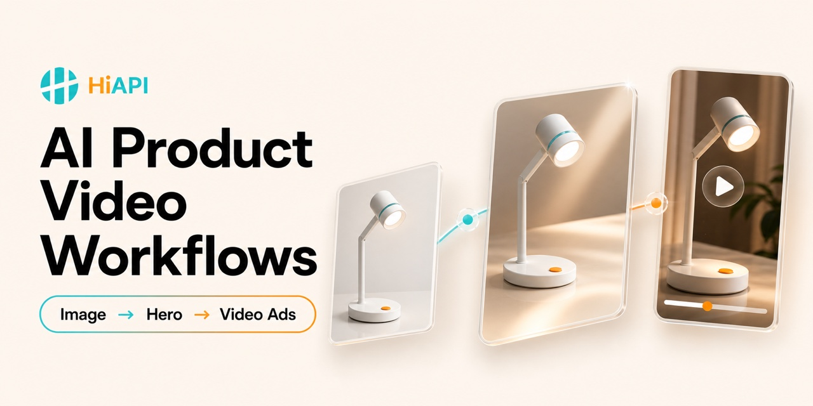

# AI Product Video Workflows: Product Images to Video Ads



Open workflows and worked cases for turning **product images into AI product videos, ecommerce video ads, UGC ads, product launch videos, TikTok ads, and Instagram Reels**. Built for ecommerce sellers, advertising teams, and AI creators who need product hero visuals, image-to-video production, social media variants, and verifiable quality control.

[简体中文](README.zh-CN.md) · [Explore the six workflows](#product-image-to-video-workflows) · [See the real UGC case](#real-ugc-clip-light-ad)

This checkout also contains a local content-integration draft. Browse the [domain
index](docs/content-integration.md) before using the sibling engines; they retain
their own schemas and runners and are not part of the root install command yet.

[](https://github.com/HiAPIAI/awesome-ai-product-video-workflows/actions/workflows/test.yml)
[](https://github.com/HiAPIAI/awesome-ai-product-video-workflows/stargazers)
[](LICENSE)

## Start in 30 seconds

```bash
npx -y github:HiAPIAI/awesome-ai-product-video-workflows -y
```

Then give the skill one approved product image and its current product page. It will build the product truth sheet first and stop before any paid generation.

## Why star this repository

- **One source-to-ad path:** product image → commercial hero visual → storyboard → video ad → platform variants.
- **Six complete workflows:** product-image audit, hero visual, image-to-video, product-page ad, UGC ad, and QC.
- **Cases you can inspect:** a real generated UGC artifact plus cinematic-launch and catalog-variant recipes.
- **Production templates:** machine-readable product brief, shot plan, workflow schema, and final-video checklist.
- **Truth before polish:** product claims, media rights, likeness permission, cost, and publication stay explicit.

If you make ecommerce ads, UGC creative, product launch videos, TikTok ads, Reels, or Shorts, Star the repository to keep the workflow library easy to find.

## What you can build

This is a workflow library and installable agent skill, not another one-click video engine. It connects the strongest reusable ideas from current open-source projects with a source-grounded production path:

`product source → image audit → commercial hero visual → storyboard → video clips → UGC or product ad → platform variants → media QC`

You get:

- six bilingual product-video workflows designed for fast navigation inside GitHub
- a machine-readable product brief, shot plan, and QC checklist
- a dated audit of high-signal GitHub repositories and license boundaries
- a real authenticated UGC video-ad case with artifact and QC evidence
- an installable `SKILL.md` for Codex and Claude Code

## Content domains

The repository is being organized around four content domains. The root package owns
the product-ad path; the other domains are isolated until their contracts are ready
for a shared release.

| Domain | Entry point | Current role |
| --- | --- | --- |
| Product ads | [`product-ads/`](product-ads/) | Source-grounded product image to ad workflows (root contract) |
| App demos | [`app-demos/`](app-demos/) | Deterministic UI demo compiler and renderer; examples remain `spec-only` |
| Live action | [`live-action/`](live-action/) | 15 Seedance 2.0 live-action workflows with dry-run runner and render evidence |
| Blender previs | [`blender-previs/`](blender-previs/) | Codex-to-Blender shot contracts and manual Seedance handoff (branch snapshot) |

See [Content Integration Draft](docs/content-integration.md) for ownership boundaries,
validation gates, and migration risks. This index does not imply that the sibling
repositories have been renamed or archived.

## Product image to video workflows

| Stage | Workflow | Best for |
| ---: | --- | --- |
| 1 | [Product Image Audit for AI Video](workflows/01-product-image-audit.md) | source rights, product truth, native image quality, and identity anchors |
| 2 | [Product Image to Commercial Hero Visual](workflows/02-product-image-to-hero-visual.md) | ecommerce hero images, ad keyframes, and product photography |
| 3 | [Hero Image to AI Product Video Ad](workflows/03-hero-visual-to-product-video.md) | image-to-video product shots and cinematic product ads |
| 4 | [Product Page to Social Video Ad](workflows/04-product-page-to-video-ad.md) | ecommerce listings, product claims, hooks, storyboards, and CTAs |
| 5 | [UGC Product Video Ad Workflow](workflows/05-ugc-product-video-ad.md) | creator demos, talking-head ads, TikTok ads, and Reels |
| 6 | [Product Video Variants and Quality Control](workflows/06-social-variants-and-qc.md) | platform crops, hook tests, captions, exports, and media QC |

Chinese editions are under [`workflows/zh/`](workflows/zh/).

## Worked product-video cases

### Real UGC clip-light ad

[](https://github.com/HiAPIAI/hiapi-seedance-2-0-ugc-ad-video-skill/blob/main/assets/examples/ugc-clip-light-e2e.mp4)

A synthetic adult creator demonstrates a fictional unbranded clip light in a 10-second vertical Seedance 2.0 video with native English dialogue. The case includes the source-grounded brief, first-frame route, runtime fixes, downloaded artifact, transcript, and an explicit limitation: visible brightness change is not enough to prove three discrete brightness levels.

[Read the case and evidence](examples/clip-light-ugc-ad/README.md)

### Cinematic product launch

A reusable recipe for converting one approved product image into multi-view references, a commercial hero frame, three shot cards, short image-to-video clips, and a product-launch rough cut.

[Open the cinematic product-launch recipe](examples/cinematic-product-launch/README.md)

### Catalog to social variants

A structured example for turning a current ecommerce listing into one master truth sheet and controlled TikTok, Reels, Shorts, and marketplace video variants.

[Open the catalog-to-social recipe](examples/catalog-to-social-variants/README.md)

## High-signal open-source foundations

This repository does not start from a blank slate. The current research combines:

- [MoneyPrinterTurbo](https://github.com/harry0703/MoneyPrinterTurbo) for the script, voice, subtitle, music, aspect-ratio, and assembly pipeline
- [Short Video Factory](https://github.com/YILS-LIN/short-video-factory) for product-marketing and batch short-video workflows
- [Video ShotCraft](https://github.com/Vincentwei1021/video-shotcraft) for product shot recipes, motion previews, and production templates
- [Generative Media Skills](https://github.com/SamurAIGPT/Generative-Media-Skills) for agent-ready image, video, and audio recipe patterns
- [OpenShorts](https://github.com/mutonby/openshorts) for product research, hooks, AI actors, captions, rendering, and QC
- [TVC Director](https://github.com/Ethanxwang/tvc-director) for product references, storyboards, keyframes, and video scripts
- [Flowboard](https://github.com/crisng95/flowboard) for reusable product-reference nodes and image-to-video composition
- [Open AI UGC](https://github.com/Anil-matcha/Open-AI-UGC) for self-hosted creator-style video ads

Exact star snapshots, license files, and code-reuse boundaries are documented in [Open-source foundations](docs/open-source-foundations.md). AGPL, Elastic, custom-license, and no-license repositories are method references only unless a downstream project deliberately accepts their terms.

## Install as an agent skill

```bash
npx -y github:HiAPIAI/awesome-ai-product-video-workflows -y
```

Choose a specific agent or skills directory:

```bash
npx -y github:HiAPIAI/awesome-ai-product-video-workflows --codex
npx -y github:HiAPIAI/awesome-ai-product-video-workflows --claude
npx -y github:HiAPIAI/awesome-ai-product-video-workflows --target=/path/to/skills
```

Then ask your agent:

```text
Use $awesome-ai-product-video-workflows to turn this product image and current product page into a 10-second vertical video-ad plan. Build the product truth sheet first and stop before paid generation.
```

The workflow library can hand execution to these existing HiAPI skills when installed:

- [HiAPI GPT Image 2 Skill](https://github.com/HiAPIAI/hiapi-gpt-image-2-skill)
- [HiAPI Video Prompt Generator Skill](https://github.com/HiAPIAI/hiapi-video-prompt-generator-skill)
- [HiAPI Seedance 2.0 Video Skill](https://github.com/HiAPIAI/hiapi-seedance-2-0-video-skill)
- [HiAPI Seedance 2.0 UGC Ad Video Skill](https://github.com/HiAPIAI/hiapi-seedance-2-0-ugc-ad-video-skill)

## Copy the production templates

```bash
cp templates/product-brief.example.json /absolute/path/to/product-brief.json
cp templates/shot-plan.example.json /absolute/path/to/shot-01.json
cp templates/qc-checklist.md /absolute/path/to/product-video-qc.md
```

Replace all demo values before production. The example deliberately contains `example.com` and unconfirmed rights flags.

## Find the workflow you need

The repository name, About description, topics, README opening, workflow titles, and examples use the same practical vocabulary people search on GitHub:

- AI product video workflows
- product image to video ad
- ecommerce video ad creation
- UGC product video ads
- product photography to commercial video
- TikTok, Reels, Shorts, and marketplace video variants

Each English workflow links to a complete Chinese edition and back to the repository index. The README leads with the useful output, quick install, real case, and six workflow choices instead of a keyword block. See [GitHub repository discovery strategy](docs/github-discovery-strategy.md).

## Truth and safety boundaries

- Do not invent product features, prices, discounts, reviews, results, certifications, or scarcity.
- Use real-person likenesses only with permission.
- Clearly record synthetic actors and follow current platform disclosure rules.
- Verify regulated-category policy before creating or publishing an ad.
- Paid generation, high-cost settings, and publication require separate approval.
- A successful API task is not a finished video. Download, decode, watch, listen, and inspect the artifact.

## Validate the repository

```bash
npm run check
```

The checks rebuild the bilingual workflow documents, validate repository discovery copy and data, scan local links, verify the social-preview image contract, and run Node tests.

## Repository structure

```text
.
├── SKILL.md
├── README.md
├── README.zh-CN.md
├── agents/openai.yaml
├── data/
│   ├── projects.json
│   └── workflows.json
├── docs/
│   ├── content-integration.md
│   ├── open-source-foundations.md
│   └── github-discovery-strategy.md
├── product-ads/
├── app-demos/engine/       # isolated demo-v1 schema and CLI
├── live-action/engine/     # isolated Seedance runner and catalog
├── blender-previs/engine/  # isolated shot schema and Blender renderer
├── examples/
├── schemas/workflow.schema.json
├── scripts/
│   ├── build-workflows.mjs
│   ├── install.mjs
│   └── validate-repository.mjs
├── templates/
└── workflows/
```

## Contributing

Corrections, stronger open workflows, and source-backed cases are welcome. Read [CONTRIBUTING.md](CONTRIBUTING.md). Do not submit affiliate links, scraped commercial copy, unverified claims, or third-party media without rights.

## License

Original repository content and code are available under the [MIT License](LICENSE). Linked projects retain their own licenses and trademarks.
