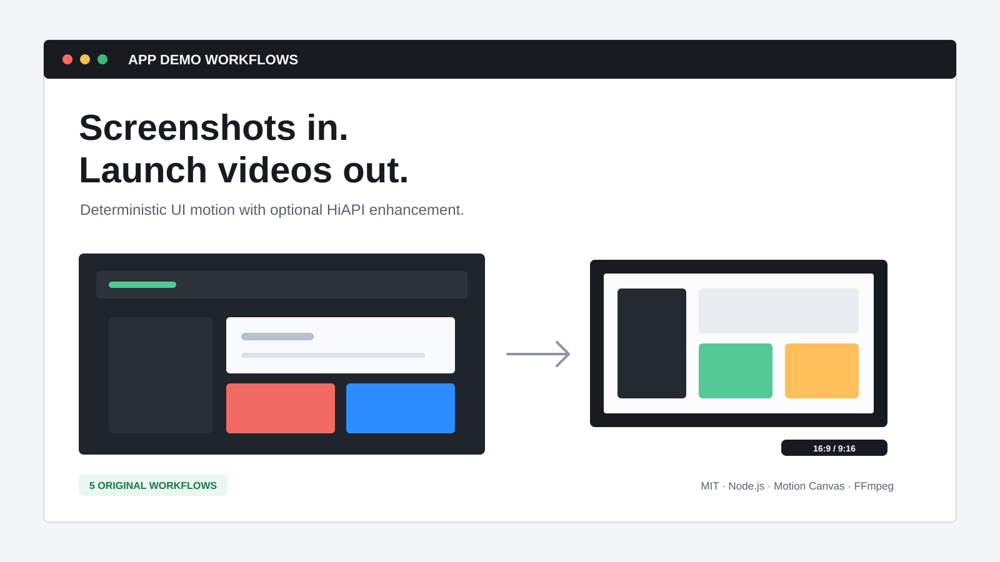

# Awesome AI App Demo Video Workflows



Open, reproducible workflows for turning app screenshots and exported UI prototype states into product demo videos. Product UI stays deterministic; optional HiAPI generation is limited to non-critical backgrounds, intros, transitions, and outros.

[简体中文](README.zh-CN.md) · [Setup](docs/setup.md) · [Authoring](docs/authoring.md) · [Schema reference](docs/schema-reference.md) · [Render acceptance](docs/acceptance-matrix.md) · [HiAPI safety](docs/hiapi-safety.md)

> Integration status: the `demo-v1` and `compiled-demo-v1` contracts and CLI names are frozen. All examples remain `spec-only`: local MP4 proof renders exist, but the visual-quality and audio review gate is not complete.

## Workflow catalog

| Workflow | Format | Length | What it demonstrates | Status |
| --- | --- | ---: | --- | --- |
| [SaaS Feature Launch](examples/saas-feature-launch/) | 16:9, 9:16 | 11s | Context, decisive interaction, measurable outcome | `spec-only` |
| [Mobile Onboarding](examples/mobile-onboarding/) | 9:16 | 10s | Welcome, preference setup, first value | `spec-only` |
| [AI Workflow Demo](examples/ai-workflow-demo/) | 16:9 | 12s | Structured input, execution, reviewed output | `spec-only` |
| [Before / After Comparison](examples/before-after-comparison/) | 16:9, 9:16 | 8s | Honest comparison with matched content and framing | `spec-only` |
| [Vertical Social Feature](examples/vertical-social-feature/) | 9:16 | 7s | One hook, one interaction, one result | `spec-only` |

The machine-readable catalog is [`data/workflows.json`](data/workflows.json). Every example includes original fictional screenshots, a `demo.yaml`, expected rhythm, and a full-video review checklist.

## Quick start

Prerequisites: Node.js 20.18 or newer, FFmpeg, and FFprobe.

The renderer requires an FFmpeg build that includes the `drawtext` filter
(usually provided by `libfreetype`). Run `npm run doctor -- --strict` before a
render. When the filter is unavailable, media-render tests are skipped and the
render command stops with an actionable environment error rather than reporting
a renderer failure.

```bash
npm ci
npm run doctor -- --strict
npm run validate -- examples/saas-feature-launch/demo.yaml
npm run compile -- examples/saas-feature-launch/demo.yaml --out-dir outputs/saas-feature-launch
npm run render -- --compiled outputs/saas-feature-launch/compiled-demo-v1.json --out-dir outputs/saas-feature-launch
```

Generated files belong under ignored `outputs/` and must not be committed. See [setup](docs/setup.md) for environment checks and [authoring](docs/authoring.md) for the complete workflow.

## Frozen command contract

```text
doctor [--strict]
validate <demo.yaml>
compile <demo.yaml> --out-dir <directory>
render --compiled <compiled-demo-v1.json> --out-dir <directory>
generate --request <hiapi-request.json> --out-dir <directory> [--confirm-preflight <token>]
```

Rendering consumes compiled JSON; it does not reinterpret source YAML. Local validation, compilation, and rendering are offline by default. `generate` must remain a dry run unless the current preflight token is explicitly confirmed.

## Optional HiAPI enhancement

HiAPI can enhance non-critical visual layers, but it must never redraw product UI, text, cursors, callouts, metrics, or other evidence a viewer relies on. Read the [HiAPI safety rules](docs/hiapi-safety.md) before any paid request.

- [Explore HiAPI](https://www.hiapi.ai/en?utm_source=github&utm_medium=readme&utm_campaign=awesome-ai-app-demo-video-workflows&utm_content=home)
- [Create an account](https://www.hiapi.ai/en/register?utm_source=github&utm_medium=readme&utm_campaign=awesome-ai-app-demo-video-workflows&utm_content=register)
- [Create an API key](https://www.hiapi.ai/en/dashboard/api-keys?utm_source=github&utm_medium=readme&utm_campaign=awesome-ai-app-demo-video-workflows&utm_content=api-key)
- [View the Seedance 2.0 model](https://www.hiapi.ai/en/models/seedance-2-0?utm_source=github&utm_medium=readme&utm_campaign=awesome-ai-app-demo-video-workflows&utm_content=seedance-model)
- [Read the API documentation](https://docs.hiapi.ai/?utm_source=github&utm_medium=readme&utm_campaign=awesome-ai-app-demo-video-workflows&utm_content=api-docs)

## Contributing

Read [CONTRIBUTING.md](CONTRIBUTING.md) before opening a pull request. Only original or clearly licensed assets are accepted. Never commit customer screenshots, credentials, signed URLs, task journals, or rendered binaries.

MIT licensed. See [NOTICE.md](NOTICE.md) for third-party and media notices.
